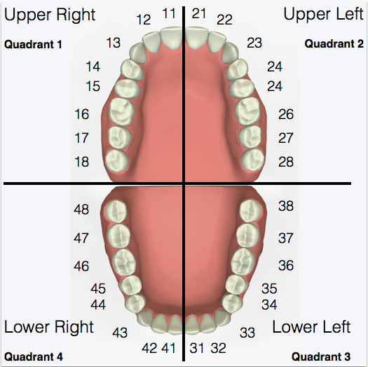
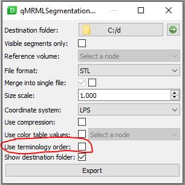
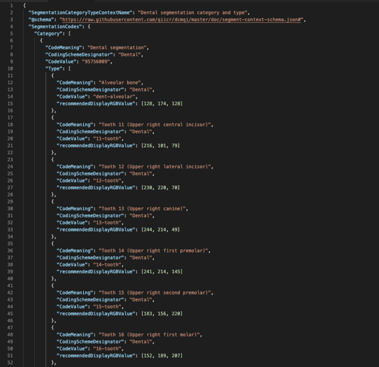

Back to [Projects List](../../README.md#ProjectsList)

# Automatic Segmentation of Teeth and Alveolar bone using MONAI Label

## Key Investigators

- Daniel Palkovics (Semmelweis University, Budapest Hungary)
- Csaba Pinter (EBATINCA, Las Palmas de Gran Canaria, Spain)
- Andrés Diaz-Pinto (King's College, NVidia)

# Project Description

<!-- Add a short paragraph describing the project. -->

A three-dimensional visualization of dento-alveolar structures can enhance the surgical planning process, however currently there are no reliable fully automated segmentation methods available to acquire realistic 3D virtual models of teeth and alveolar bone. A time consuming semi-automatic method has previously been utilized for diagnostic purposes and surgical planning of regenerative-reconstructive surgical procedures in periodontology and oral surgery.

## Objective

<!-- Describe here WHAT you would like to achieve (what you will have as end result). -->

The aim of this project is to develop an automatic method utilizing MONAI Label to speed up segmentation process of dento-alveolar structures on cone-beam computed tomography datasets.

1. Objective A. To develop a fast and relible segmentation method that is capable of the separate 3D reconstuction of teeth and alveolar bone on CBCT datasets of periodontally involved patients

## Approach and Plan

<!-- Describe here HOW you would like to achieve the objectives stated above. -->

1. Try to create MONAILabel app for segmenting said structures
2. Consult with the experts about the details

## Progress and Next Steps

<!-- Update this section as you make progress, describing of what you have ACTUALLY DONE. If there are specific steps that you could not complete then you can describe them here, too. -->

1. Through varios conversations with especially Andrés (special thanks to him), we learned the following that will be useful for this project:
    * It is possible to segment the teeth as one structure or per-tooth as well. In both cases we will need to use MultiLabelDeepEdit due to the presence of the alveolar bone structure
    * It is possible to set up multi-stage inference in which the first stage can be preprocessing such as automatic cropping or removal of artifacts such as implants or bridges
    * For initial experimentation a typical desktop GPU with 8GB can be used, however to achieve a well performing model it is recommended to have a professional one with >16GB memory
        * A feasible option for this is to use an AWS instance
    * This problem is different from the majority of segmentation tasks because missing structures are very commonplace (i.e. missing teeth especially for a patient who needs implant planning)
    * The issue of the missing teeth needs to be carefully handled
    * Use consistent numbering (see image below)
    * Make sure the same teeth have the same label # (i.e. skip those that are not present)
    * The way Slicer exports the segmentations does not fully support this use case
1. Plan to improve segmentation export in Slicer
    * Add option both in segmentation export widget and segmentation logic to use the current terminology context for generating the same label for each structure (see image below)
        * Many details to figure out: How to handle modifiers and anatomic regions, What happens when there are more than 255 usable entries, etc. We will start simple.
    * Create a custom terminology context for this use case (alveolar bone + the 32 teeth, see image below)
    * Update the existing datasets to have the correct terminology of each structure and re-export the segmentations
    * Create simple module for single-click batch export of the MRBs for DeepEdit usage (to make sure the segmentation extent is the same as the master volume extent and to use terminology-based label numbers)

# Illustrations

<!-- Add pictures and links to videos that demonstrate what has been accomplished.

-->

Example segmentation:

Tooth numbering scheme (EU):

New option in segmentation export to consider terminology:

Draft of dental segmentation terminology:

# Background and References

<!-- If you developed any software, include link to the source code repository. If possible, also add links to sample data, and to any relevant publications. -->

1.	Palkovics D, Mangano FG, Nagy K, Windisch P. (2020) Digital three-dimensional visualization of intrabony periodontal defects for regenerative surgical treatment planning. BMC Oral Health, 20: 351.
2.	Palkovics D, Pinter C, Bartha F, Molnar B, Windisch P. (2021) CBCT subtraction analysis of 3D changes following alveolar ridge preservation: a case series of 10 patients with a 6-month follow-up. Int J Comput Dent, 24: 241-251.
3.	Palkovics D, Solyom E, Molnar B, Pinter C, Windisch P. (2021) Digital Hybrid Model Preparation for Virtual Planning of Reconstructive Dentoalveolar Surgical Procedures. J Vis Exp, doi:10.3791/62743.
4.	Sólyom E, Palkovics D, Pintér C, Mangano FG, Windisch P. (2021) Virtuális tervezés és volumetrikus kiértékelés egy komplex parodontális defektus regeneratív-rekonstruktív sebészi ellátásában: Egy eset bemutatása. Fogorvosi Szemle, 114: 120-130
